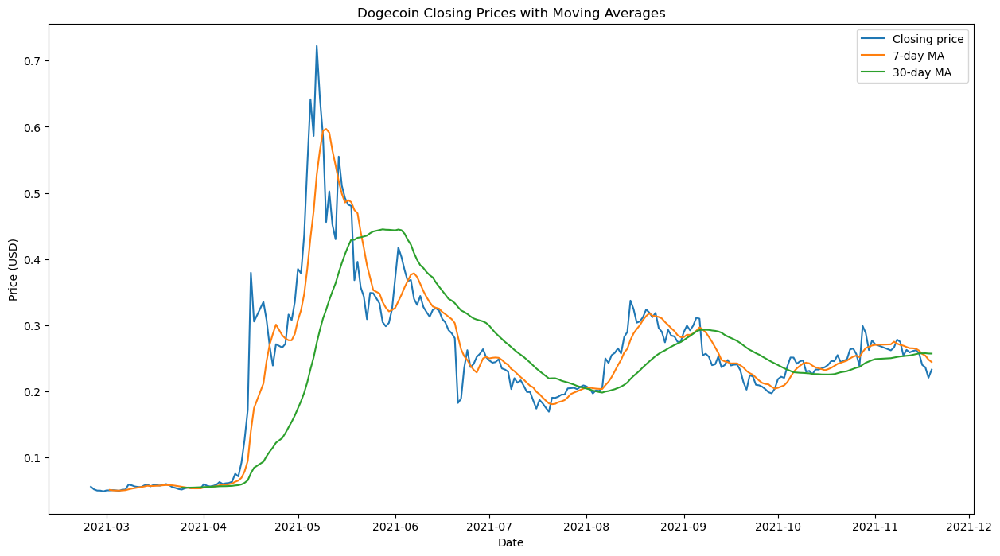

# Dogecoin Project

Author: John Ludlum

Last update: 6/19/2023

## Description

A multiple linear regression model is made to predict the price of Dogecoin from 2/24/2021 to 11/19/2021.

`data/raw` contains the following files:

- `dogecoin_prices.csv` Dogecoin price data downloaded from [CoinDesk](https://www.coindesk.com/price/dogecoin/).
- `google_trends_data.csv` daily search trends for Dogecoin obtained from [Google Trends](https://trends.google.com/trends/explore?date=2021-02-24%202021-11-19&geo=US&q=dogecoin). Values close to 0 indicate few searches while values close to 100 indicate many searches on a given day compared to other days in the selected time period.
- `social_sentiment.txt` social media (Twitter & Telegram) sentiment data for Dogecoin scraped from [CoinDesk](https://www.coindesk.com/price/dogecoin/)

The raw datasets were cleaned and merged in `dogecoin_dataset.csv` which is located in `data/processed`. 

Data cleaning and modeling is performed in the Jupyter notebook `dogecoin_project.ipynb`.

## Plots

